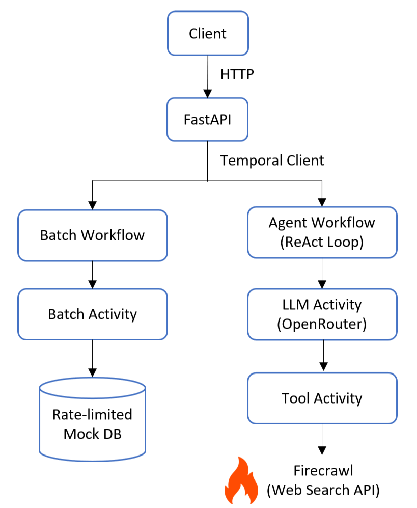

# Temporal-Based Workflow & Agent System

## Overview

This project demonstrates how to design and implement:

* A **rate-limited batch processing system** using Temporal
* A **fault-tolerant ReAct agent system** with LLM + tool calling

The system is built to handle **long-running, stateful, and failure-prone tasks**
by leveraging Temporal’s workflow orchestration capabilities.

It combines traditional backend workflow design with modern LLM-based agent systems.

---

## Key Features

### 1. Batch Processing System

* Queue-based request handling
* Sequential batch execution (no parallel writes)
* Rate limiting (100 items per 10 seconds)
* Workflow-level state management (no external DB)
* Runtime control via signals:

  * pause
  * resume
  * discard

👉 Designed to simulate **real-world constrained systems**
(e.g., rate-limited external APIs or legacy DBs)

---

### 2. Agent System (ReAct-based)

* LLM-driven reasoning loop (ReAct pattern)
* Tool calling (web search)
* Observation-based iterative reasoning
* Max step limit to prevent infinite loops

👉 Implemented **without LangChain**, directly on Temporal

---

### 3. Fault Tolerance

* Workflow state persisted by Temporal
* Activity-level retry & recovery
* Execution resumes after worker restart

👉 Ensures reliability for **long-running AI workflows**

---

## Architecture



- FastAPI acts as the entry point
- Temporal orchestrates workflows
- Batch workflow handles rate-limited processing
- Agent workflow implements a ReAct-based reasoning loop

---

## System Design

### Batch Workflow

* Maintains internal queue
* Processes requests in chunks
* Enforces strict rate limiting
* Fully controlled via workflow signals

### Agent Workflow

* Implements ReAct loop inside workflow
* Each step (LLM / Tool) is an Activity
* Conversation state stored in workflow
* Fault-tolerant execution across steps

---

## Why Temporal?

This system uses Temporal to handle:

* Durable execution
* Stateful workflows
* Fault recovery
* Long-running processes

Unlike traditional task queues,
Temporal guarantees that execution resumes from failure points.

---

## Prompt Design

* Prompt is externalized (`/api/prompts`)
* Injected into workflow input for deterministic execution
* Designed to:

  * enforce tool usage
  * reduce hallucination
  * encourage structured output

---

## Tech Stack

* Python
* FastAPI
* Temporal
* OpenRouter (LLM)
* Firecrawl (Web Search)
* Docker Compose

---

## How to Run

```
docker-compose up --build
```

Access:

* API Docs: http://localhost:8000/docs
* Temporal UI: http://localhost:8080

---

## API

### Batch System

* POST /promo/codes
* POST /promo/pause
* POST /promo/resume
* GET /promo/status
* POST /promo/discard

> Note: API paths are named for legacy reasons (promo),
> but internally implemented as a generic batch workflow.

---

### Agent System

* POST /agents/crawler

Example:

```
curl -X POST "http://localhost:8000/agents/crawler" \
-H "Content-Type: application/json" \
-d '{"input": "Get company info of OpenAI"}'
```

---

## Fault Tolerance Test

1. Send request
2. Stop worker
3. Restart worker

Result:

* Workflow paused safely
* State persisted
* Execution resumed from exact step

---

## Limitations

* No external persistence beyond Temporal
* Agent output may not always be perfectly structured
* Depends on external APIs (LLM, search)

---

## Key Takeaways

* Temporal can be used to build **stateful backend systems**
* Agent workflows benefit from **durability and recovery**
* ReAct pattern can be implemented without external frameworks

---

## Future Improvements

* Streaming agent steps
* Better output validation
* Additional tools (beyond web search)
